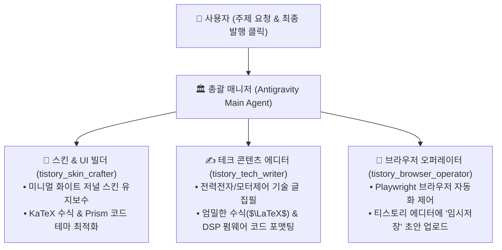

# 🏛️ 티스토리 기술 블로그(power-n-life) 전담 에이전트 운영 가이드

> **블로그 주소**: [power-n-life.tistory.com](https://power-n-life.tistory.com)  
> **컨셉**: 전력전자 & 임베디드 SW 전문 **'미니멀 화이트 저널(Substack/Medium 스타일)'**  
> **운영 원칙**: **안전 협업 모드** (AI가 초안/임시저장까지 등록하고, 최종 발행은 사용자 승인)

---

## 🌳 1. 티스토리 전담 에이전트 팀 (Agent Tree)

본 프로젝트에는 티스토리 관리를 전담하는 **3인의 전문 서브에이전트**가 배치되어 있습니다:



---

## 🎨 2. '미니멀 화이트 저널' 스킨 적용 방법 (최초 1회, 1분 소요)

제작된 고품질 스킨은 `Tstory_/` 폴더에 완벽히 빌드되어 있습니다.

1. 웹 브라우저에서 [**티스토리 스킨 편집 페이지**](https://power-n-life.tistory.com/manage/design/skin/edit)에 접속합니다.
2. 우측 상단의 **[HTML 편집]** 버튼을 클릭합니다.
3. **HTML 탭**: [**`Tstory_/skin.html`**](file:///c:/Users/test/OneDrive/문서/AntiGravity_Projects/making%20homepage/Tstory_/skin.html) 파일 전체 내용을 복사하여 붙여넣습니다.
4. **CSS 탭**: [**`Tstory_/style.css`**](file:///c:/Users/test/OneDrive/문서/AntiGravity_Projects/making%20homepage/Tstory_/style.css) 파일 전체 내용을 복사하여 붙여넣습니다.
5. 우측 상단 **[적용]** 버튼을 누르면 즉시 **미니멀 화이트 저널 테마**가 블로그에 반영됩니다!

---

## ✍️ 3. 새 기술 글 작성 및 자동 임시저장 워크플로우

### Step 1: AI에게 주제 말하기
채팅창에 편하게 원하는 주제를 말씀해주세요.
> *"오늘 공부한 TI DSP 인터럽트 설정 관련해서 기술 블로그 글 하나 써줘"*

### Step 2: 테크 에디터가 로컬 초안 생성
- `tistory_tech_writer`가 [`PORTFOLIO_DOSSIER.md`](file:///c:/Users/test/OneDrive/문서/AntiGravity_Projects/making%20homepage/PORTFOLIO_DOSSIER.md) 및 사용자 메모를 참고하여 `Tstory_/posts/`에 마크다운 및 HTML 초안을 작성합니다.
- 복잡한 회로 수식($\Delta V_{dc}$, Fourier 급수 등)과 C/Embedded C 코드가 완벽한 형태로 서식화됩니다.

### Step 3: 브라우저 자동화 에이전트가 티스토리에 초안 등록
터미널에서 아래 명령어를 실행하거나, AI에게 *"티스토리에 초안 올려줘"*라고 요청합니다:
```bash
npm run tistory:draft
```
- Playwright 브라우저가 티스토리 글쓰기 창을 띄우고 본문을 입력한 뒤 **[임시저장]** 버튼을 누릅니다.
- **최초 1회**: 카카오 로그인이 필요할 경우 화면에서 로그인하시면 세션이 `.tistory_session`에 영구 저장됩니다.
- 저장이 완료되면 결과 스크린샷(`Tstory_/scripts/last_draft_result.png`)을 확인하실 수 있습니다.

### Step 4: 사용자 최종 확인 후 발행
- 티스토리 관리자 화면의 [임시저장함]에서 글을 열어 가볍게 눈으로 확인하신 후 **[발행]** 버튼을 누르시면 안전하게 세상에 공개됩니다!

---

## 📁 4. 폴더 및 파일 구조

```
Tstory_/
├── index.xml                         # 티스토리 공식 스킨 명세 메타데이터
├── skin.html                         # 미니멀 화이트 저널 HTML (KaTeX + Prism.js)
├── style.css                         # Hallmark 표준 고품질 스타일시트
├── README.md                         # 본 운영 가이드
├── templates/
│   └── tech_article_template.md      # 전력전자/임베디드 표준 서식 템플릿
├── posts/
│   ├── 01_welcome_and_roadmap.md     # 1호 공식 환영 및 로드맵 포스트 (마크다운)
│   └── 01_welcome_and_roadmap.html   # 변환 완료된 티스토리 전용 HTML
└── scripts/
    ├── md_to_tistory_html.js         # 마크다운 -> 티스토리 맞춤 HTML 변환기
    └── upload_draft.js               # Playwright 기반 브라우저 자동 초안 업로더
```
